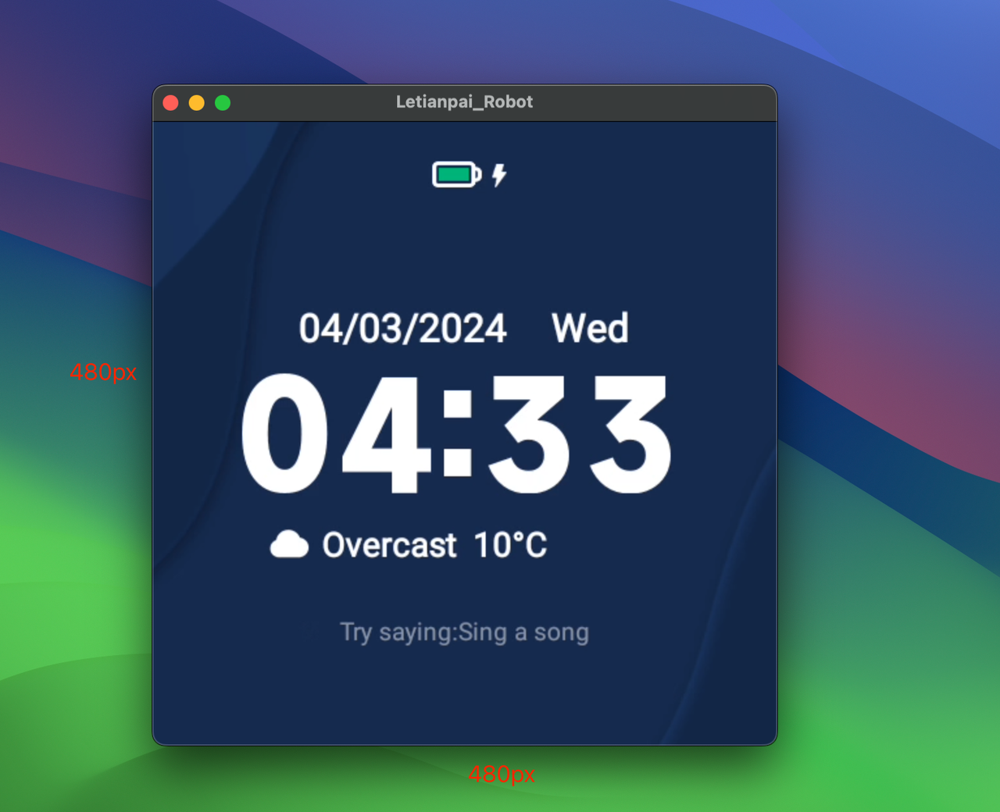
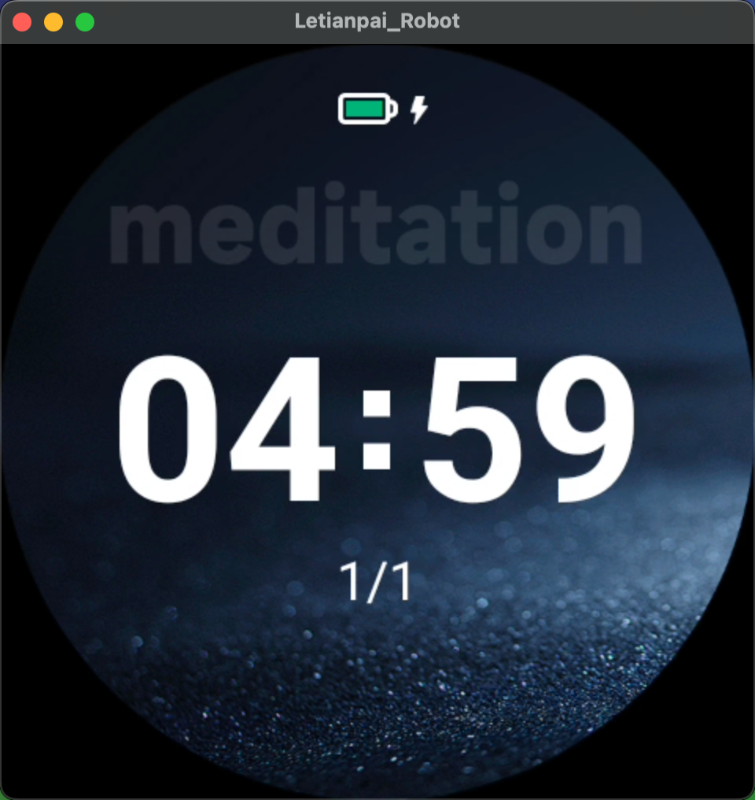
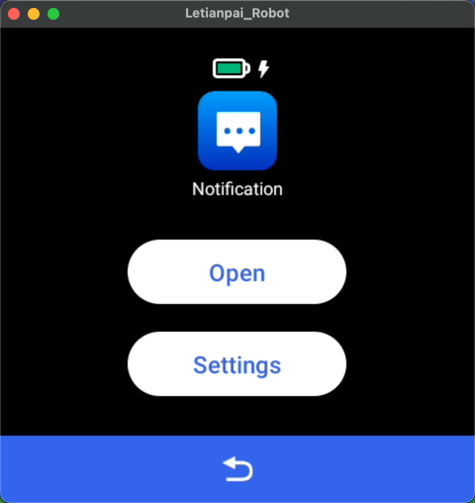
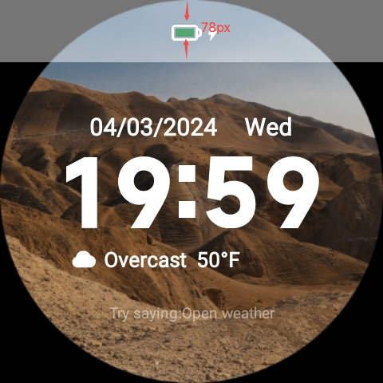

# Règles de développement app tierce

Source : [机器人软件开发规范说明](https://cn.letianpai.com/?p=7593), 2024. GeeUIVoiceEmo est une app tierce. Elle ne part pas dans la ROM.

## App

Une app développée ici s'installe par APK. Elle ne s'embarque pas dans le paquet ROM.

Android 11. Bluetooth et micro : API Android natives, pas de couche maison imposée. Le MCU passe par le RobotSDK, tutoriel [p=5915](https://cn.letianpai.com/?p=5915).

## Écran

480×480 px. Unité `px` seulement, pas de `dp` / `bp`. Le hors-cercle n'est pas visible. Les boutons restent dans la zone cliquable. Réserver 78 px en haut pour la barre d'état (batterie, Wi-Fi).

## Perf et contenu

Pas de fuite, pas de ressource tenue pour rien. Pas de contenu politique, sexuel ou violent dans l'app. Permissions au strict nécessaire.

La page cite la loi chinoise sur la cybersécurité. Pour ce projet, la contrainte utile est locale : l'app ne doit pas dépendre d'un hôte CN au boot.
