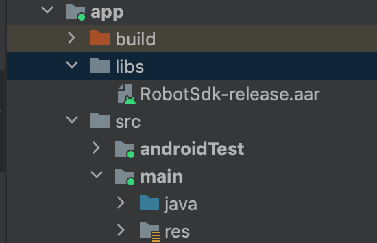
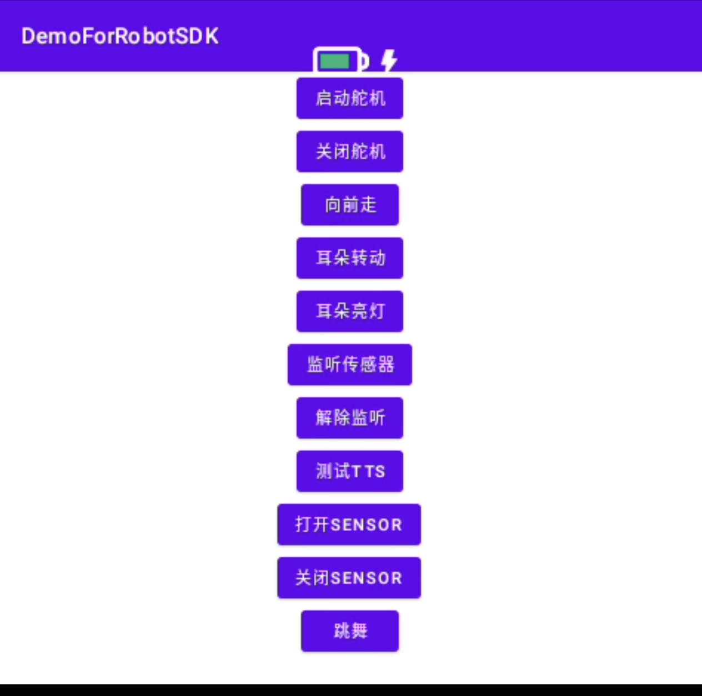

# RobotSDK

Source : [乐天派桌面机器人RobotSDK使用说明](https://cn.letianpai.com/?p=5915). Demo : [Letianpai-Robot/DemoForRobotSDK](https://github.com/Letianpai-Robot/DemoForRobotSDK).






## AAR

Déposer l'AAR dans `app/libs/`. Non commité.

| Version | Lien publié |
|---|---|
| 2.5 | https://cdn.file.letianpai.com/b765d7f0250777afe5745ddc46d0c234/RobotSDK/RobotSdk-release-2.5.aar |
| 2.2 | https://cdn.file.letianpai.com/b765d7f0250777afe5745ddc46d0c234/RobotSDK/RobotSdk-release-2.2.aar.zip |
| 2.0 | https://cdn.file.letianpai.com/b765d7f0250777afe5745ddc46d0c234/RobotSDK/RobotSdk-release.aar.2.0.zip |
| 1.0 | https://cdn.file.letianpai.com/b765d7f0250777afe5745ddc46d0c234/RobotSDK/RobotSdk-release.aar.1.0.zip |

2.3 et 2.1 sont listés sur la page, sans URL dans le HTML. 1.0 : marche, antennes, lumière, sons, TTS, cliff / ToF. 2.0 : expressions.

```kotlin
val robot = RobotService.getInstance(this)
robot.robotOpenMotor()   // une fois, pas sur le thread UI
robot.robotCloseMotor()
robot.unbindService()
```

## Oreilles

`AntennaMessage.set(cmd, step, speedMs, angle)`.

| Arg | Sens |
|---|---|
| cmd | 1 les deux oreilles à gauche, 2 à droite, 3 à gauche (la page répète « gauche » pour 1 et 3 ; le demo utilise 3) |
| step | nombre de répétitions |
| speed | intervalle en ms |
| angle | amplitude 0–90°. Au-delà, le firmware ramène à 90 |

```kotlin
val ears = AntennaMessage()
ears.set(3, 2, 300, 60)
robot.robotAntennaMotion(ears)
```

## Lumière antenne

La page ne montre que `Light.RED`. L'AAR 2.5, inspecté, a `RED GREEN BLUE ORANGE WHITE YELLOW PURPLE CYAN BLACK`. Pas d'autre mode que on/couleur et `robotCloseAntennaLight`.

```kotlin
val lamp = AntennaLightMessage()
lamp.set(Light.RED)
robot.robotAntennaLight(lamp)
robot.robotCloseAntennaLight()
```

## Face

`robotStartExpression` une fois, puis `robotChangeExpression`. `robotStopExpression` sort du mode.

La liste des faces est dans [FACES.md](FACES.md), extraite du Feishu public du 14 août 2024.

Tags utilisés par GeeUIVoiceEmo, corrigés d'après ce doc : `h0006` 大笑, `h0001` 愤怒, `h0046` 惊讶, `h0133` 害怕, `h0119` 哭泣, `h0059` 常规环. `h0134` est 听歌星光, pas la peur. `h0189` est 摸头, pas un neutre.

## Action

`ActionMessage.set(number, speed, stepNum)` puis `robotActionCommand`. Le demo marche avec le numéro 63 (avance 2).

| n | Geste | Défaut |
|---|---|---|
| 1 | avance | step=n, speed=3 |
| 2 | recule | step=n, speed=3 |
| 3 | tourne à gauche | step=n, speed=3 |
| 4 | tourne à droite | step=n, speed=3 |
| 5 | crabe gauche | step=n, speed=3 |
| 6 | crabe droite | step=n, speed=3 |
| 7 | secousse jambe gauche | step=1, delay=2 |
| 8 | secousse jambe droite | step=1, delay=2 |
| 9 | secousse pied gauche | step=2, delay=3 |
| 10 | secousse pied droit | step=2, delay=3 |
| 11 | pied gauche levé | step=1, delay=1 |
| 12 | pied droit levé | step=1, delay=1 |
| 13 | penche à gauche | step=1, delay=6 |
| 14 | penche à droite | step=1, delay=6 |
| 15 | tape du pied gauche | step=1, delay=3 |
| 16 | tape du pied droit | step=1, delay=3 |
| 17 | corps haut-bas | step=1, delay=1 |
| 18 | corps gauche-droite | step=1, delay=1 |
| 19 | tête gauche-droite | step=2, delay=1 |
| 20 | repos | step=1, delay=1 |
| 21 | rotation gauche sur place (~20°) | step=1, delay=3 |
| 22 | rotation droite sur place (~20°) | step=1, delay=3 |
| 23 | double secousse pieds | step=3, delay=1 |
| 24 | micro-secousse | step=1, delay=3 |
| 25 | micro-tour gauche (~5°) | step=1, delay=3 |
| 26 | micro-tour droite (~5°) | step=1, delay=3 |
| 27 | balancement | step=1, speed=3 |
| 28 | hochement | step=1, speed=3 |
| 29–33 | aléatoire | step=1, speed=3 (33 min 3) |
| 34 | micro-rotation pied | min 3, speed=3 |
| 35–42 | aléatoire / petite secousse pieds | step=1, speed=3 |
| 43 | petit hochement | step=1, speed=3 |
| 44 | esquive gauche | step=1, speed=3 |
| 45 | esquive droite | step=1, speed=3 |
| 46 | petite esquive gauche | step=1, speed=3 |
| 47 | petite esquive droite | step=1, speed=3 |
| 48 | secousse externe des deux pieds, rapide | step=1, vitesse fixe |
| 49 | double secousse rapide | step=1, vitesse fixe |
| 50 | torsion avant-arrière | step=1, speed=3 |
| 51 | petite secousse pied gauche | step=1, speed=3 |
| 52 | petite secousse pied droit | step=1, speed=3 |
| 53 | pied gauche vers l'extérieur | step=1, speed=3 |
| 54 | pied droit vers l'extérieur | step=1, speed=3 |
| 55 | tour gauche −3° | step=1, speed=3 |
| 56 | tour droite −3° | step=1, speed=3 |
| 57 | micro-tour pied droit | step=1, speed=3 |
| 58 | grande esquive droite | step=1, vitesse fixe |
| 59 | frottement avant-milieu-arrière | step=1, speed=3 |
| 60 | frottement avant-arrière | step=1, speed=3 |
| 61 | jambe levée | step=1, vitesse fixe |
| 62 | jambe levée + secousse | step=1, vitesse fixe |
| 63 | avance 2 | step=1, speed=3 |
| 64 | recule 2 | step=1, speed=3 |
| 65 | rotation pied gauche rapide | min 3, vitesse fixe |
| 66 | rotation pied droit rapide | min 3, vitesse fixe |
| 67 | secousse rapide | step=1, vitesse fixe |
| 68 | secousse externe rapide | step=1, vitesse fixe |
| 69 | pas sur plot 2 | step=1, speed=1 |
| 70 | pas sur plot 3 | step=1, speed=1 |
| 71–75 | rotation sur plot 1 à 5 | step=1, speed=2 |
| 76 | oui de la tête | step=1, speed=3 |
| 77 | yeah | step=1, speed=3 |
| 78 | torsion rapide | step=1, speed=1 |
| 79 | corps qui tangue | step=1, speed=1 |
| 80 | torsion danse | step=2, speed=6 |

GeeUIVoice utilise encore `AT+MOVEW` numéro 98 pour la marche réelle. Ce tableau SDK n'a pas de 98. Ne pas mélanger les deux numérotations.

## Capteurs

`robotOpenSensor` / `robotCloseSensor`, puis `robotRegisterSensorCallback`.

| Callback | Page CN | Sens probable |
|---|---|---|
| onTapResponse | tap tête | un coup |
| onDoubleTapResponse | double tap | |
| onLongPressResponse | appui long | |
| onFallBackend | cliff avant | la page dit « avant » pour Backend |
| onFallForward | cliff arrière | la page dit « arrière » pour Forward |
| onFallRight | cliff gauche | libellés inversés sur la page |
| onFallLeft | cliff droite | |
| onTof | obstacle | |

Les noms Java et le texte chinois ne matchent pas. À vérifier sur le robot avant de s'en servir.

## Sons et commandes longues

`robotControlSound("a0020")` joue un son embarqué. `robotPlayTTs` est le TTS du SDK, pas le nôtre. On ne l'utilise pas : la voix reste Lemonade / CosyVoice.

`sendLongCommand("speechDance", "from_third")` et `speechMusic` : danse / musique, arrêt par tap sur la tête.

Sons utiles pour une émotion, tels que publiés :

| id | nom CN | sens |
|---|---|---|
| a0020 | 生气 | colère |
| a0032 | 哈哈哈 | rire |
| a0037 | 害怕 | peur |
| a0039 | 惊喜感 | surprise joyeuse |
| a0070 | 慌张 | panique |
| a0086 | 难过 | triste |
| a0095 | 惊讶 | surprise |
| a0107 | 尴尬 | gêne |
| a0133 | 失落 | déçu |

La page en liste d'autres (bips, charge, messages). Pas repris ici.
